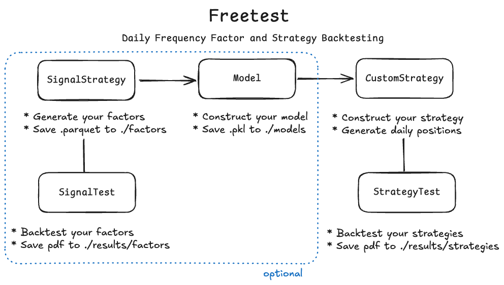
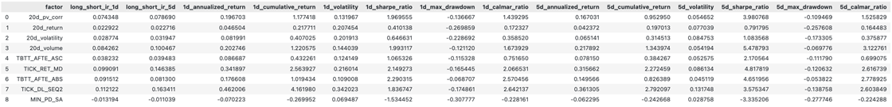
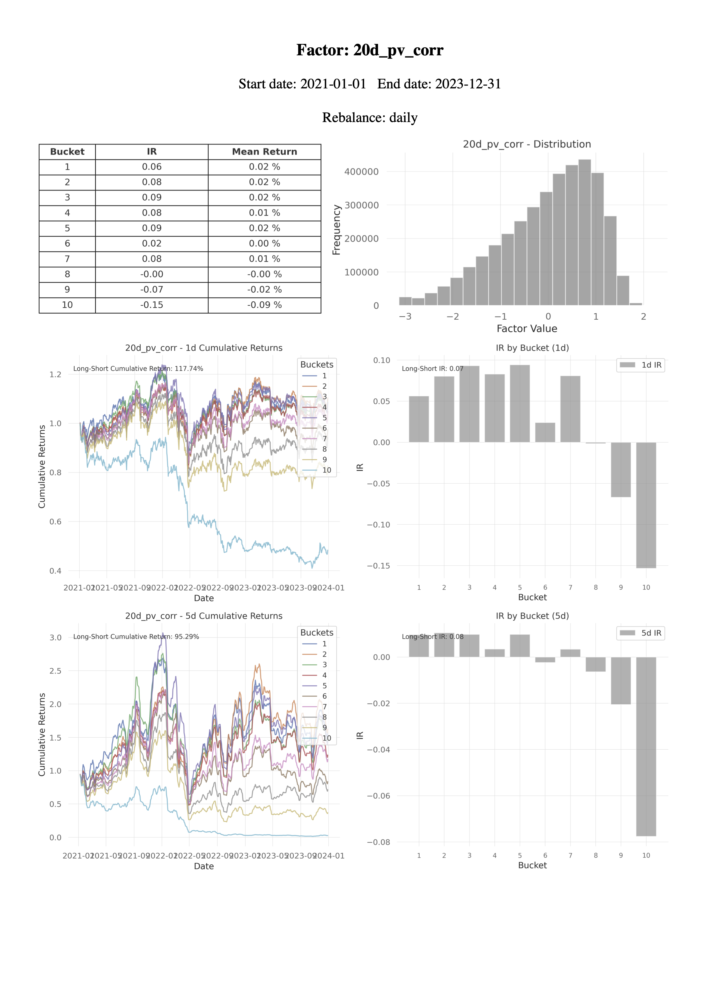
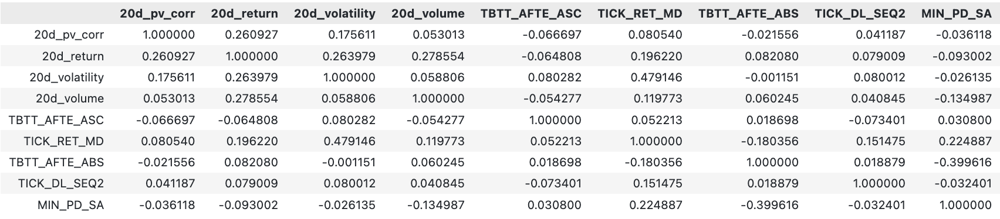
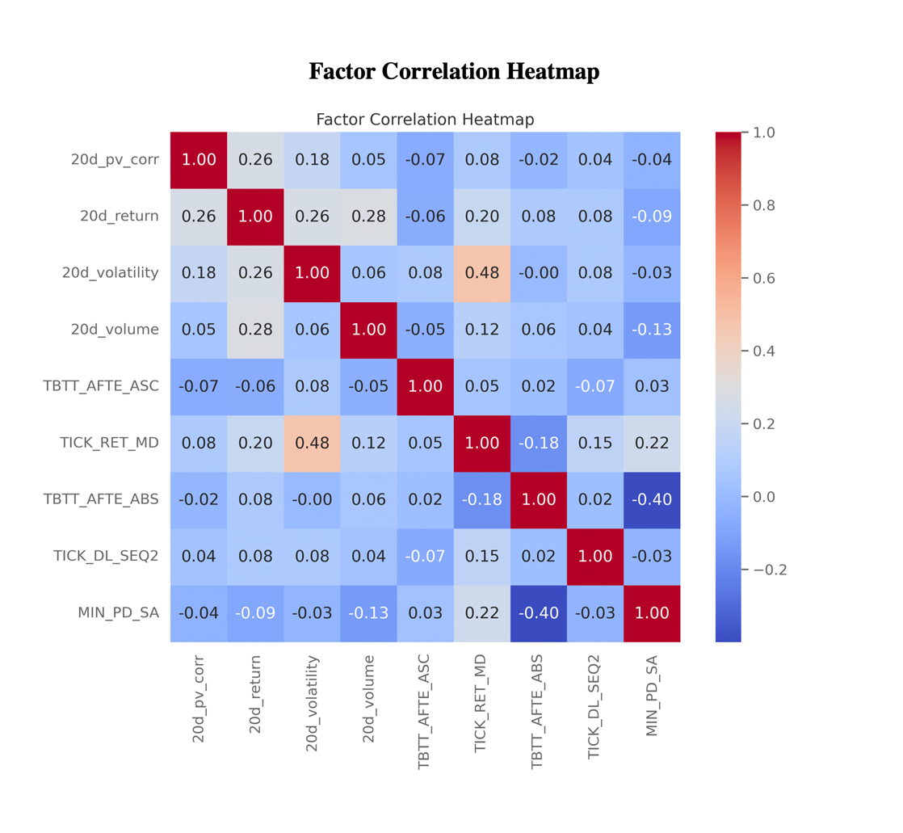
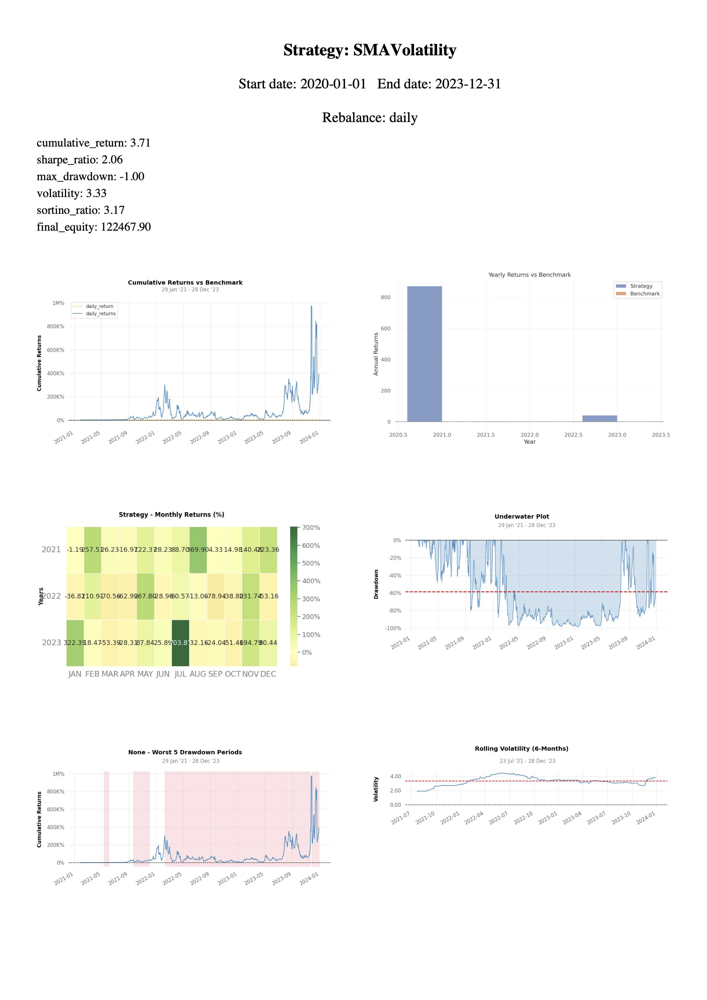
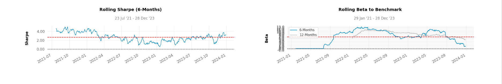

# README

`Freetest`是一款由Mingshang JI创建的，用于日频因子和策略回测的系统，主要功能包括：



## 策略项目文件管理要求

由于读取本地因子等使用了相对路径，需要对文件管理提出一些要求。在项目文件夹中，需要按照以下结构进行管理：

```
project/
├── main.py           # 主程序入口
├── README.md         # 项目说明文件
├── codes/            # 用于放置策略或因子的代码
│   ├── factor_1.py   # 因子1的生成函数
│   └── factor_2.py   # 因子2的生成函数
├── data/             # 用户自己的数据
│   ├── my_personal_bars.parquet
│   ├── my_personal_snapshots.parquet
├── factors/          # 用于储存本地的因子文件
│   ├── factor_1/     # 因子1每日的因子值
│   │   ├── 2020-01-03.parquet
│   │   ├── 2020-01-04.parquet
│   │   ├── 2020-01-05.parquet
│   ├── factor_2/
│   │   ├── 2020-01-03.parquet
│   │   ├── 2020-01-04.parquet
│   │   ├── 2020-01-05.parquet
├── logs/             # 用于储存运行过程中的日志
│   ├── factors/      # 因子日志
│   │   ├── factor_1.log
│   │   ├── factor_2.log
│   ├── strategies/   # 策略日志
│   │   ├── strategy.log
├── models/           # 用于储存模型结果
│   ├── model_1/
│   │   ├── model_1.pkl
│   ├── model_2/
│   │   ├── model_2.pkl
├── results/          # 用于储存生成的测试结果
│   ├── factors/      # 因子回测结果
│   │   ├── factor_1/
│   │   │   ├── factor_1.pdf
│   │   │   ├── factor_1.json
│   │   ├── correlation/
│   │   │   ├── factor_1_factor_2.pdf
│   ├── strategies/   # 策略回测结果
│   │   ├── strategy_1/
│   │   │   ├── strategy_1.pdf
│   │   │   ├── strategy_1.json
```

用户需自行创建的文件夹：
- `./codes`
- `./data`
- `./factors`
- `./results`
- `./logs`
- `./models`
其余文件夹会在运行过程中自动生成。

## `SignalStrategy` 类

`SignalStrategy` 类主要用于因子的 **生成、存储和加载**，适用于因子类策略。

---

### 类的参数和属性

- **参数：**  
  - `time (str)`：因子生成的时间点，例如 `"15:00:00"`。  
  - `start (str)`：因子生成的初始日期，格式为 `'YYYY-MM-DD'`。  
  - `end (str)`：因子生成的结束日期，格式为 `'YYYY-MM-DD'`。  
  - `name (str)`：因子名称，用于指定因子生成代码文件和输出路径。

- **属性：**  
  - `data (pd.DataFrame)`：使用 `get_factor` 函数生成的因子数据，格式为 `pd.DataFrame`。因子生成完成前，此属性为 `None`。  
  - `self.logger`：日志对象，储存在 `./logs/factors/factor_name.log` 中，用于记录因子生成过程和调试信息。

---

### 类函数

**`generate_signal()`**  
根据因子代码文件 `./codes/factor_name.py`，生成指定日期段的因子，并保存到 `./factors/factor_name/{self.time}/` 目录中。  

- **功能描述：**  
  - 每个日期生成一个以 `YYYY-MM-DD.parquet` 命名的因子文件，保存到 `./factors/factor_name/{timestamp}/` 目录。  
  - **代码文件要求：** 必须包含一个名为 `factor` 的函数，该函数接收 `date` 和 `timestamp` 参数，并返回一个 `pd.Series`，其中 `index` 为股票代码，值为因子值。

---
### 示例用法

在 `./codes/factor_name.py` 文件中，定义因子函数

```python
def factor(date, timestamp="15:00:00"):
    # 生成因子逻辑
    factor_data = ...  # 这里为生成因子的逻辑
    return pd.Series(factor_data, index=stock_codes)
```

定义因子值策略，并生成因子值

```python
from freetest.Strategy import SignalStrategy

factor_name = SignalStrategy(
                  time="15:00:00",# 因子生成时间点
                  start="2020-02-03", # 开始生成日期
                  end="2023-12-31",# 结束生成日期
                  name="factor_name" #因子名称
                  )
factor_name.generate_signal()
```

## `SignalTest`类

用于 `SignalStrategy` 类的回测，用于因子的回测和分层分析，并生成 PDF 报告。

### 类的参数和属性

- 参数
  - `factors (list)`：包含所有需要测试的因子名的列表。
  - `data (pd.DataFrame)`：市场价格数据（需要有 `date`, `timestamp`, `close`, `open`, `high`, `low`）。
  - `benchmark (str)`：可选 `mean`，沪深300、中证500、中证800、中证1000、上证50。
  - `time (str)`：回测时间点。
  - `start (str)`：回测开始日期。
  - `end (str)`：回测结束日期。
  - `bucket (int)`：因子分层个数，如果选择 5 层，表示将股票按照因子值划分为 5 组，每组对应一个分位区间（如从最低到最高的因子值）。
  - `pool (str)`：股票池设置，可以为全市场、沪深300、中证500、中证800、中证1000、上证50等。
  - `rebalance (str)`：可根据日历（`weekly`, `monthly`, `quarterly` 等）或者自定义重新平衡（`custom`）。

- **属性**
  - `result (pd.DataFrame)`：`run()` 之后得到的每日回测结果。
  - `stats (dict)`：`get_stats()` 之后得到的回测各项指标。

---

### 类函数

1. **`run(self)`**  

   主回测逻辑，返回每日的收益率和累计收益率。

   * **逻辑：**

     - 通过分层处理因子数据，计算不同分位区间的收益率。

     - 计算 1 日和 5 日的累计收益率。

     - 计算多空收益和 IR（信息比率）。

   * **返回：**

     * `pd.DataFrame`：包含每日收益率和累计收益率。


2. `get_stats(self) -> pd.DataFrame`

     - **逻辑：**
       
       - 计算多空策略的 IR、年化收益率、波动率、最大回撤等指标。
       - 保存每个因子的指标到 `./results/factors/factor_name/factor_name.json` 文件中。
       
      - **返回：**

           - `pd.DataFrame`：包含各项统计指标。

           - **示例输出：**

                

3. **`plot_signal(self, output_folder='./results/factors/')`**
    绘制因子的表现图，生成 PDF 报告，包括：

      - **内容：**
        
        - 分层累计收益率折线图（1d 和 5d）。
        - 分层收益率的 IR（信息比率）柱状图。
        - 因子分布直方图。
        - 分层IR和return统计表格。
        
      - **保存路径：**
        - 报告存储于 `./results/factors/factor_name/factor_name.pdf`。
        
        - 示例报告：
        
          
    
4. **`plot_correlation(self, output_folder='./results/factors/correlation') -> pd.DataFrame`**
      绘制所有因子的相关性热力图，并保存为 PDF 文件。

      - **逻辑：**
        
        - 使用因子数据计算相关性矩阵。
        - 绘制相关性热力图，并保存到 `./results/factors/correlation/`。
        
      - **返回：**
      
        - `pd.DataFrame`：因子的相关性矩阵。
      
      - **示例输出：**
      
        
      
      - **示例报告：**
      
        

---

### 示例用法

```python
from freetest.Backtest import SignalTest

factors = ['fac_1', 'fac_2', 'fac_3']

signal_test = SignalTest(
        factors = factors, # 一个list,包含所有你想要回测的因子名称
        data = df,# 每日的高开低收数据
        start = "2021-01-01", # 回测开始时间
        end = "2023-12-31", # 回测结束时间
        benchmark = "mean",  # 使用均值作为基准，也可以自定义（一个pd.Series, date为index，值为benchmark）
        factor_time = "15:00:00", # 因子生成时间
        time = "15:00:00",  # 回测时间
        bucket = 10,  # 分层个数
        pool = "all",  # 全市场股票池，也可以设置为500等
        rebalance = "daily",  # 调仓周期
    )

results = signal_test.run()
signal_test.get_stats()
signal_test.plot_signal()
signal_test.plot_correlation()
```

## `Model` 类

`Model` 类主要是将一个 `pd.DataFrame` 格式的因子集，转化为一个 **索引为股票代码、值为预测值** 的 `pd.Series`。这里的预测值可以为下一个交易日的超额收益率等。

---

### 类的参数和属性

* **参数：**

  - `data (pd.DataFrame)`  ：用于预测的数据集。

- `name (str)`  ：模型名称，用于保存和加载模型。

  - `save_model (bool)`  ：是否保存模型到文件，默认为 `True`。

* **属性：**

  - `prediction (pd.Series)`  ：最终预测的结果，一个 **索引为股票代码、值为预测值** 的 `pd.Series`，在模型拟合前为 `None`。


---

### 类函数

1. **`linear_fit(target: str, l1: float = 0.0, l2: float = 0.0) -> pd.Series`**  
   构建一个 **线性回归模型**，可以设置 L1 和 L2 正则化系数。在训练过程中，记录回归结果并将模型保存为 `.pkl` 文件到 `./models` 目录，最终返回预测值。
   - **参数：**  
     - `target (str)`：数据集中目标列的名称。  
     - `l1 (float)`：L1 正则化系数，默认为 `0`。  
     - `l2 (float)`：L2 正则化系数，默认为 `0`。  

   - **返回：**  
     - `pd.Series`：预测值，索引为股票代码。

---

2. **`log_fit(target: str, l1: float = 0.0, l2: float = 0.0) -> pd.Series`**  
   构建一个 **Logistic 回归模型**，可以设置 L1 和 L2 正则化系数。在训练过程中，记录回归结果并将模型保存为 `.pkl` 文件到 `./models` 目录，最终返回预测值。

   - **参数：**  
     - `target (str)`：数据集中目标列的名称。  
     - `l1 (float)`：L1 正则化系数，默认为 `0`。  
     - `l2 (float)`：L2 正则化系数，默认为 `0`。  

   - **返回：**  
     - `pd.Series`：预测值，索引为股票代码。

---

3. **`fit_with_function(model_function: callable, target: str) -> pd.Series`**  
   使用 **用户传入的模型函数** 对数据进行训练和预测，训练后会把模型存到`./models/model_name/model_name.pkl`中
   - **参数：**  
     - `model_function (callable)`：用户定义的函数，用于创建和训练模型。必须返回 `(model, predictions)`。  
     - `target (str)`：数据集中目标列的名称。  

   - **返回：**  
     - `pd.Series`：预测值，索引为股票代码。

---

4. **`load_model(model_name: str) -> object`**  
   加载已保存的模型。
   - **参数：**  
     - `model_name (str)`：模型名称。  

   - **返回：**  
     - `object`：加载的模型对象。

---

5. **`predict_with_model(data: pd.DataFrame, var: list) -> pd.Series`**  
   使用加载的模型生成预测值，最终的metrics会保存在`./results/models/model_name/model_name_{save_name}.json`中
   - **参数：**  
     - `data (pd.DataFrame)`：需要用来预测的数据。  
     - `var (list)`：用于预测的自变量名称列表。  

   - **返回：**  
     - `pd.Series`：预测值。

---

6. **`calculate_metrics(data: pd.DataFrame, target: str, pred: str) -> dict`**  
   计算预测值的评估指标，包括 **R²、MSE、MAE、Accuracy、F1 Score** 等，并保存到 JSON 文件。
   - **参数：**  
     - `data (pd.DataFrame)`：包含真实值和预测值的数据集。  
     - `target (str)`：真实值列的名称。  
     - `pred (str)`：预测值列的名称。  

   - **返回：**  
     - `dict`：包含各项评估指标的字典。

---

### 示例用法

- 事先准备好的数据集df（pd.DataFrame），`target`为需要预测的列名， `factor_names`为自变量的list

- 初始化一个`Model`类：

  ```python
  from freetest.Model import Model
  
  model = Model(data=df_train, # 数据集
                  name="model_name", # 模型名称
                  save_model=True, # 是否要保存模型
              )
  ```

- 写好模型的函数，必须有2个返回，一是`model`（训练好的决策树模型）、`predictions (pd.Series)` （训练数据的预测结果），例如：

  ```python
  def model_function(X, y):
      """
      参数:
          X (pd.DataFrame): 特征数据集。
          y (pd.Series): 目标变量数据集。
          
      返回:
          model: 训练好的决策树模型。
          predictions (pd.Series): 训练数据的预测结果。
      """
      # 构建模型
      model = #...
      
      # 训练模型
      model.fit(X, y)
      
      # 生成预测值
      predictions = pd.Series(model.predict(X), index=X.index)
      
      return model, predictions
  ```

- 调用`fit_with_function()`来训练数据，训练后会把模型存到`./models/model_name/model_name.pkl`中（后续想要调用某个模型，直接用`load_model()`就行）

  ```python
  df_train['train_prediction'] = model.fit_with_function(
                                      model_function, # 模型结构函数
                                      target='log_return', 
                                      var=factor_names)
  ```

- 调用 `predict_with_model()` 对测试集进行预测

  ```python
  df_test['test_prediction'] = model.predict_with_model(df_test, var=factor_names)
  ```

- 最后，使用`calculate_metrics`对模型效果进行评估，最终的metrics会保存在`./results/models/model_name/model_name_{save_name}.json`中

  ```python
  train_metrics = model.calculate_metrics(df_train, target='log_return', pred='train_prediction', save_name='train')
  test_metrics = model.calculate_metrics(df_test, target='log_return', pred='test_prediction', save_name='test')
  ```

另一个例子，使用类自带的线性回归函数：

```python
from freetest.Model import Model

# 初始化 Model 类
model = Model(data=df, name="my_linear_model")

# 使用线性回归模型拟合
predictions = model.linear_fit(target="excess_return", l1=0.1, l2=0.1)

# 计算评估指标
metrics = model.calculate_metrics(data=df, target="excess_return", pred=predictions.name)

# 保存和加载模型
model.load_model("my_linear_model")
```

## `CustomStrategy` 类

`CustomStrategy` 类用于构建自定义多因子策略，包括 **选股、组合权重优化** 和 **调仓执行**功能。

---

### 类的参数和属性

- **参数：**  
  - `data (pd.DataFrame)`：包含因子和价格数据，用于交易决策。  
  - `model (callable)`：预测因子得分的用户模型函数。  
  - `start (str)`：策略开始日期，格式为 `'YYYY-MM-DD'`。  
  - `end (str)`：策略结束日期，格式为 `'YYYY-MM-DD'`。  
  - `name (str)`：策略名称，用于日志记录和输出文件命名。  
  - `rebalance (str)`：调仓周期，可选值包括 `'daily'`, `'weekly'`, `'monthly'`, `'quarterly'`, `'6m'`, `'1y'`。  
  - `equity (float)`：当前账户净值，包括现金和资产，初始值由用户设置。  
  - `optimizer (str)`：选择的组合权重优化器类型，可选值包括 `"EF"`, `"HRP"`, `"MINVAR"`, `"EQUAL"`。  
  - `target (str)`：优化目标，可选值包括 `"max_sharpe"`, `"min_volatility"`。

- **属性：**  
  - `position (Position)`：当前组合持仓对象，记录股票持仓权重。  
  - `self.daily_positions`：用于记录每日的持仓快照，类型为 `dict`。  
  - `self.buy_list`：记录需要买入的股票列表。  
  - `self.sell_list`：记录需要卖出的股票列表。  
  - `logger`：日志对象，储存在 `./logs/strategies/{self.name}.log` 中，用于记录策略执行过程和调试信息。

---

### 类函数
1. **`optimize(self, historical_data: pd.DataFrame) -> Dict[str, float]`**  
   使用指定的优化器进行组合权重优化。  
   - **参数：** 
     - `historical_data (pd.DataFrame)`：历史价格数据，行索引为日期，列名为股票代码。  
   - **返回：** 
     - `Dict[str, float]`：优化后的组合权重。
2. **`rebalance_portfolio(self, historical_data: pd.DataFrame, date: str)`**  
   根据调仓周期、优化方法以及买入/卖出列表执行组合调仓。 
   - **参数：** 
     - `historical_data (pd.DataFrame)`：历史高开低收价格数据，行索引为日期，列名为股票代码。 
     - `date (str)`：当前调仓日期，格式为 'YYYY-MM-DD'。 
   - **返回：** 
     - 无返回值，修改`self.position`和`self.daily_position`
3. **`buy(self, symbol: str)`** 
   将指定的股票添加到待买入列表中。 
   - **参数：** 
     - `symbol (str)`：需要买入的股票名称。 
   - **返回：**  
     - 无返回值，修改`self.buy_list`
4. **`sell(self, symbol: str)`** 
   将指定的股票添加到待卖出列表中。 
   - **参数：** 
     - `symbol (str)`：需要卖出的股票名称。 
   - **返回：** 
     - 无返回值，修改`self.sell_list`
5. **`init(self)`** *(抽象方法)*  
   初始化策略。用户在子类中实现此方法，声明所需的指标并进行预计算。 
6. **`next(self)`** *(抽象方法)*  
   策略的主运行逻辑。用户需在子类中重写此方法，根据调仓周期和预测因子生成交易信号，并更新组合。


### 示例用法

```python
from abc import ABC
from freetest.Strategy import CustomStrategy

class MyStrategy(CustomStrategy):
    def init(self):
        """
        初始化策略
        """
        self.model = Model(data=self.data, name="decision_tree_model", save_model=False) # 某个模型
        self.data['pred_return'] = self.model.predict_with_model(self.data, var=factor_names)

    def next(self):
        """
        策略主逻辑：
        - 基于预测值对股票进行排序，选择买入和卖出的列表。
        """
        dates = sorted(self.data["date"].unique()) 
        data = self.data

        for date in dates:
            # 某些条件，买入symbol
            self.buy(symbol)
            # 某些条件，卖出symbol
            self.sell(symbol)
            # 基于历史数据，根据调仓周期、优化方法和待买入/卖出列表执行组合调仓。
            historical_data = self.data[self.data["date"] <= date]
            pivot_data = historical_data.pivot(index="date", columns="symbol", values="close")
            self.rebalance_portfolio(pivot_data, date)

my_strategy = MyStrategy(data=df, # 包含有高开低收和因子值的数据集
                        model = None, # 由于已经在上面的类中定义过model了，这里就无需再定义
                        rebalance="daily", # 调仓频率
                        start="2022-01-01", # 策略开始时间
                        end="2023-12-31", # 策略结束时间
                        optimizer="EQUAL", # 优化器选择，所有股票分配相同权重
                        name="My_Strategy" # 策略名称
                        )

# 开始策略执行：
my_strategy.init()
my_strategy.next()
```

最终的策略其实本质上是一个包含有date和当日需要交易的股票名称以及对应权重的dict，后续只要调用`my_strategy`就可以进行策略回测

## `StrategyTest`类

用于策略的回测，计算回测结果、统计指标，并生成可视化报告。

### 类的参数和属性

- **参数**
  - `strategy`：策略对象，包含自定义交易逻辑和信号生成。
  - `data (pd.DataFrame)`：市场价格数据，包含 `date`, `timestamp`, `close`, `open` 等字段。
  - `benchmark (str)`：基准收益率，可选 `mean`、沪深300、中证500、中证800、中证1000、上证50。
  - `start (str)`：回测开始日期，格式为 `YYYY-MM-DD`。
  - `end (str)`：回测结束日期，格式为 `YYYY-MM-DD`。
  - `pool (str)`：股票池设置，可选值包括 `all`、沪深300、中证500 等。
  - `equity (float)`：初始资金，默认值为 `1,000,000`，随回测动态更新为当前账户净值。
  - `commission (float)`：交易成本比例，默认值为 `0.001`。

- **属性**
  - `result (pd.DataFrame)`：`run()` 方法执行后生成的每日回测结果，包括每日收益率和累计收益率。
  - `stats (dict)`：`get_stats()` 方法生成的回测统计指标。
  - `logger`：日志对象，用于记录回测过程，存储在 `./logs/strategies/` 目录下。

---

### 类函数

1. **`run(self)`**

   执行回测逻辑，生成每日收益率和累计收益率。

   - **逻辑：**
     - 根据策略信号计算每日持仓、收益率。
     - 计算交易成本，并更新账户净值。
     - 汇总每日的收益率和累计收益率。

   - **返回：**
     - `pd.DataFrame`：包含每日收益率和累计收益率的结果。

---

2. **`get_stats(self)`**

   计算回测的统计指标，包括累计收益率、年化波动率、夏普比率等，并保存为 JSON 文件。

   - **逻辑：**
     - 计算回测结果的统计指标。
     - 将指标保存到 `./results/strategies/{strategy_name}/{strategy_name}.json`。

   - **返回：**
     - `dict`：包含统计指标的字典。

   - **示例输出：**

     ```json
     {
         "cumulative_return": 0.177417,
         "sharpe_ratio": 1.969555,
         "max_drawdown": -0.136667,
         "volatility": 0.131967,
         "sortino_ratio": 1.439295,
         "final_equity": 117417.54
     }
     ```

---

3. **`plot_strategy(self)`**

   绘制策略表现图并生成 PDF 报告，包括累计收益、年度收益、月度收益热力图等。

   - **逻辑：**
     - 绘制以下图表：
       - 策略累计收益 vs 基准收益
       - 年度收益对比图
       - 月度收益热力图
       - 回撤分析图
       - 滚动波动率、夏普比率、Beta值
     - 将图表保存至 `./results/strategies/{strategy_name}`。
     - 汇总图表生成 PDF 报告。

   - **示例报告：**
     
   
     


---

### 示例用法

```python
my_backtest = StrategyTest(strategy=my_strategy, # 策略类
                          data=df, # 每日的高开低收数据
                          start="2022-01-01", # 回测开始时间
                          end="2023-12-31", # 回测结束时间
                          benchmark = "mean",  # 使用均值作为基准
                          pool = "all",  # 全市场股票池，也可以设置为500等
                          equity = 100000,  # 初始资金
                          commission=0.001 # 交易成本比例
                          )
result = my_backtest.run()
stats = my_backtest.get_stats()
my_backtest.plot_strategy()
```

## `utils`辅助函数

### 日志处理

1. **`log_strategy(strategy_name, factor)`**
   记录因子或策略运行过程的日志。

   - **参数：**
     - `strategy_name (str)`：策略名称，用于指定日志文件名。
     - `factor (bool)`：是否为因子类策略，True 为因子类，False 为普通策略。

   - **返回：**
     - `logging.Logger`：配置好的日志对象。

   - **功能：**
     - 创建日志文件并记录策略运行日志。
     - 日志文件存储路径：
       - 因子类：`./logs/factors/<strategy_name>.log`
       - 普通策略：`./logs/strategies/<strategy_name>.log`

   - **示例用法：**
     ```python
     logger = log_strategy("my_strategy", factor=False)
     logger.info("This is a test log entry.")
     ```

---

### 时间处理

2. **`get_trade_day(date, gap)`**
   获取与给定日期相差 `gap` 个交易日的目标日期。

   - **参数：**
     - `date (datetime or str)`：基准日期，格式为 `YYYY-MM-DD` 或 `datetime` 对象。
     - `gap (int)`：目标交易日与基准日期的偏移量（正值为未来，负值为过去）。

   - **返回：**
     - `datetime`：目标交易日。

   - **注意：**
     - 确保输入日期为有效交易日，否则会抛出 `ValueError`。

   - **示例用法：**
     ```python
     target_date = get_trade_day("2022-01-01", 5)
     print(target_date)  # 输出：5 个交易日后的日期
     ```

3. **`get_trade_day_list(start, end)`**
   返回给定起止日期范围内的所有交易日列表（闭区间）。

   - **参数：**
     - `start (datetime or str)`：起始日期。
     - `end (datetime or str)`：结束日期。

   - **返回：**
     - `list[datetime]`：交易日列表。

   - **注意：**
     - 起始日期必须早于或等于结束日期。
     
   - **示例用法：**
     ```python
     trade_days = get_trade_day_list("2022-01-01", "2022-01-10")
     print(trade_days)  # 输出：交易日列表
     ```

---

### 数据处理

4. **`align_time_index(data, delta)`**
   对股票数据进行时间对齐，确保所有股票在指定时间间隔下有一致的时间索引。

   - **参数：**
     - `data (pd.DataFrame)`：包含时间列和其他数据列的 DataFrame，必须包含 `symbol` 列。
     - `delta (str)`：时间频率，例如 `1d`（日频）、`30m`（30 分钟频）。

   - **返回：**
     - `pd.DataFrame`：对齐后的数据框，缺失的时间点将填充为 `NaN`。

   - **示例用法：**
     ```python
     aligned_data = align_time_index(data, "1d")
     print(aligned_data.head())
     ```

5. **`calculate_returns(data, delta, lag)`**
   计算滞后收益率序列。

   - **参数：**
     - `data (pd.DataFrame)`：包含 `symbol`、`date` 和 `close` 列的股票数据。
     - `delta (str)`：时间频率，例如 `1d` 或 `30m`。
     - `lag (int)`：滞后期。

   - **返回：**
     - `pd.DataFrame`：新增 `return_lag_<lag>` 列，表示滞后收益率。

   - **示例用法：**
     ```python
     result = calculate_returns(data, delta="1d", lag=1)
     print(result[["symbol", "date", "return_lag_1"]].head())
     ```

6. **`cumulative_returns(data, delta)`**
   计算累计收益率。

   - **参数：**
     - `data (pd.DataFrame)`：包含 `symbol` 和 `close` 列的股票数据。
     - `delta (str)`：时间频率，例如 `1d`。

   - **返回：**
     - `pd.DataFrame`：新增 `cumulative_return` 列，表示累计收益率。

   - **示例用法：**
     ```python
     cumulative_data = cumulative_returns(data, "1d")
     print(cumulative_data.head())
     ```

7. **`get_factor(factor_name, timestamp, start, end)`**
   获取本地因子数据（Parquet 文件）。

   - **参数：**
     
     - `factor_name (str)`：因子名称。
     - `timestamp (str)`：因子生成时间，例如 `15:00:00`。
     - `start (datetime or str)`：起始日期。
     - `end (datetime or str)`：结束日期。
     
   - **返回：**
     - `pd.DataFrame`：包含因子值的数据框。
   
   - **示例用法：**
     ```python
     factor_data = get_factor("momentum_factor", "15:00:00", "2022-01-01", "2022-01-10")
     ```

8. **`get_factors(factor_names, timestamp, start, end)`**
   获取多个因子并合并为一个数据框。

   - **参数：**
     - `factor_names (list[str])`：因子名称列表。
     - `timestamp (str)`：因子生成时间。
     - `start (datetime or str)`：起始日期。
     - `end (datetime or str)`：结束日期。

   - **返回：**
     - `pd.DataFrame`：合并后的数据框，包含多个因子值。

   - **示例用法：**
     ```python
     factors = ["momentum", "volatility"]
     combined_data = get_factors(factors, "15:00:00", "2022-01-01", "2022-01-10")
     ```
   
9. **`sma(data, factor_name, delta, n)`**
   计算因子的简单移动平均值（SMA）。

   - **参数：**
     - `data (pd.DataFrame)`：包含因子数据的 DataFrame。
     - `factor_name (str)`：因子名称。
     - `delta (str)`：时间频率。
     - `n (int)`：窗口大小。

   - **返回：**
     - `pd.DataFrame`：新增列 `sma_<factor_name>_<n>`，为因子的 SMA。

   - **示例用法：**
     ```python
     sma_data = sma(data, factor_name="momentum", delta="1d", n=5)
     print(sma_data.head())
     ```

10. **`transform_signal(data, factor_name, operation, subtype=None, cover=False)`**
    对因子进行各种变换操作。

    - **参数：**
      - `data (pd.DataFrame)`：包含因子数据的 DataFrame。
      - `factor_name (str)`：因子列名称。
      - `operation (str)`：操作类型，例如：
        - `normalize`：标准化。
        - `deextreme`：去极值。
        - `winsorize`：Winsorize 方法。
        - `transform`：值变换（`log`, `sqrt`）。
        - `fillna`：填充缺失值。
      - `subtype (str)`：子操作类型，具体取决于 `operation`。
      - `cover (bool)`：是否覆盖原因子列，默认 `False`。

    - **返回：**
      - `pd.DataFrame`：处理后的数据框。

    - **示例用法：**
      ```python
      transformed_data = transform_signal(data, "momentum", "normalize", cover=True)
      ```
    
11. **`market_neutralize(data, factors, market_value_col='market_value_security')`**
    对因子进行市值中性化处理。

    - **参数：**
      - `data (pd.DataFrame)`：包含因子数据和市值列的数据框。
      - `factors (list[str])`：需要进行中性化的因子名称列表。
      - `market_value_col (str)`：市值列名称，默认 `market_value_security`。

    - **返回：**
      - `pd.DataFrame`：新增中性化后的因子列，命名为 `neutralized_<factor_name>`。

    - **示例用法：**
      ```python
      neutralized_data = market_neutralize(data, ["momentum", "volatility"])
      ```

